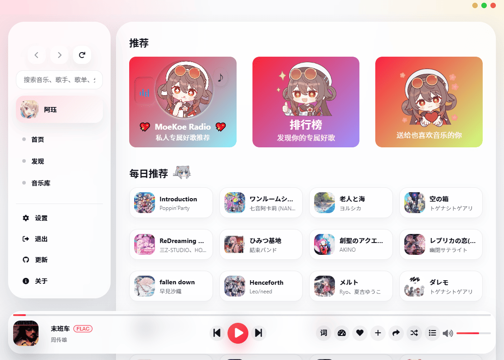

# Apple Music 主题

适用于 MoeKoe Music 的界面主题插件。

这个插件会把顶部导航调整为左侧边栏，并将主内容区、播放器和整体留白改成更接近 Apple Music 的布局风格。

## 安装方法

### 方式一：软件内自动安装（推荐）

适用场景：插件已上架到 MoeKoe 插件市场。

1. 打开 `设置 -> 插件管理`
2. 切换到 `插件市场`
3. 搜索插件并点击 `安装`
4. 安装完成后刷新插件列表或重启应用

### 方式二：GitHub 手动下载安装

1. 从 GitHub 下载本项目源码（`Code -> Download ZIP`）
2. 解压后找到目录：`plugins/extensions/apple-music-theme`
3. 安装方式二选一：
4. 复制文件夹到 MoeKoe 插件目录（`plugins/extensions`），然后在插件管理中刷新
5. 或将该文件夹打包为 zip，在 `设置 -> 插件管理 -> 安装插件` 中选择 zip 安装

## 文件说明

- `manifest.json`：插件信息、入口和图标配置
- `content.js`：主题注入逻辑
- `styles.css`：主题样式
- `popup.html` / `popup.js`：插件设置界面
- `background.js`：插件初始化逻辑
- `logo.png`：插件图标

## 注意事项

- 这个主题依赖当前 MoeKoe Music 的头部结构。如果宿主版本后续调整了头部 DOM，插件可能需要同步更新。
- 修改后如果没有立即生效，请先刷新插件列表；若仍无变化，再重启应用。

